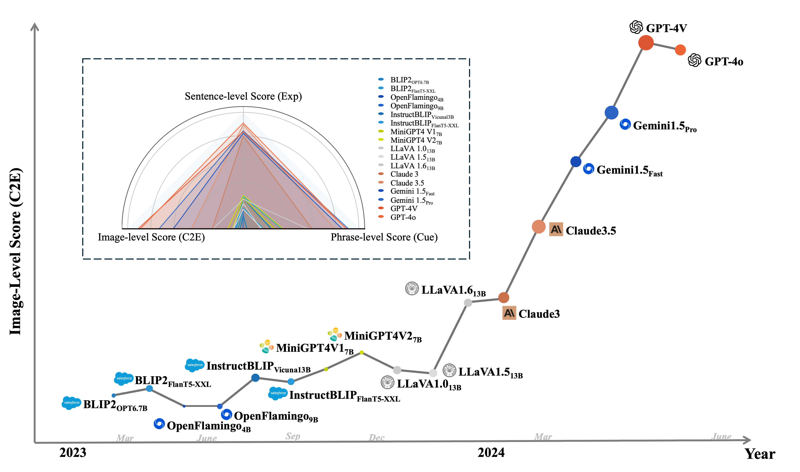
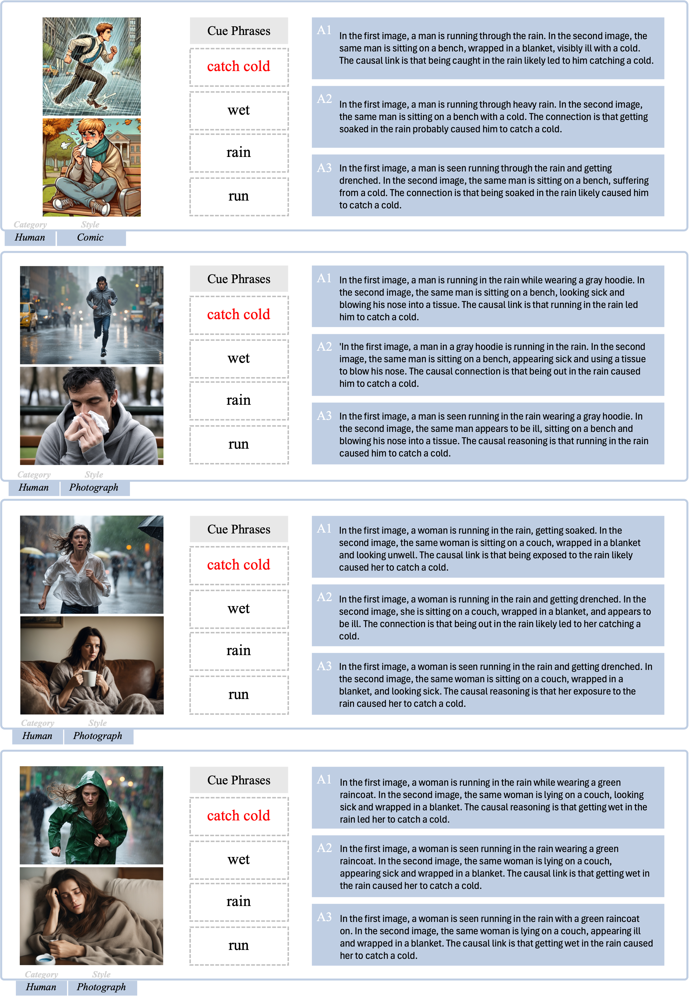
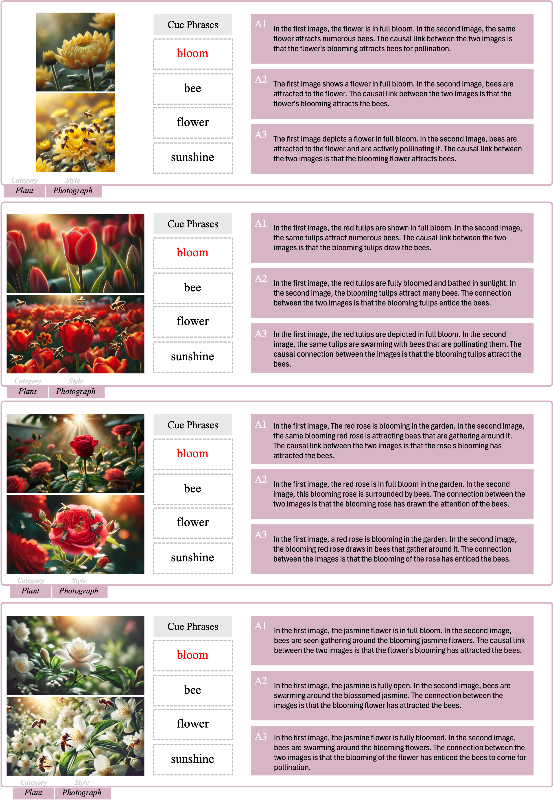
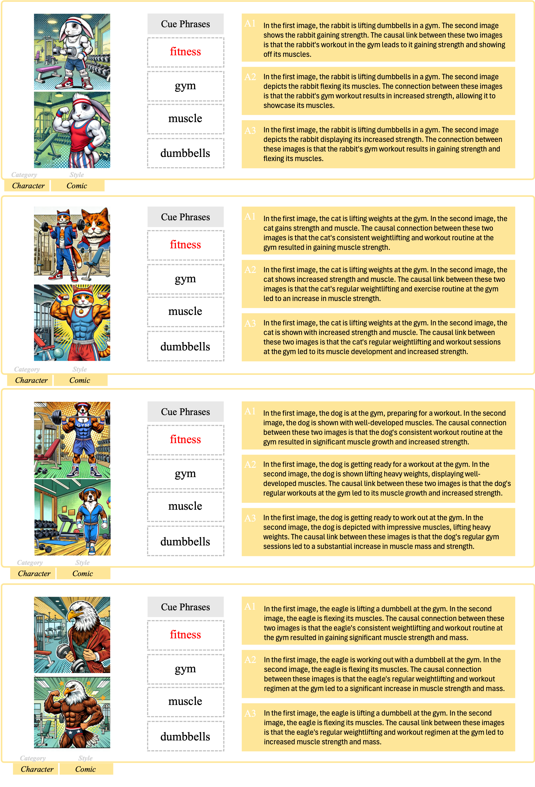

<p align="center">
<h1 align="center">  Multimodal Causal Reasoning Benchmark: Challenging Vision Large Language Models to Infer Causal Links Between Siamese Images</h1>
</p>

<div align="center">

[**Zhiyuan Li**](https://github.com/Zhiyuan-Li-John)<sup></sup> · [**Heng Wang**](https://scholar.google.com.au/citations?user=jPj4ViQAAAAJ&hl=en&oi=ao)<sup></sup> · [**Dongnan Liu**](https://scholar.google.com.au/citations?user=JZzb8XUAAAAJ&hl=en&oi=ao)<sup></sup> · [**Chaoyi Zhang**](https://scholar.google.com.au/citations?user=GSM6eT0AAAAJ&hl=en&oi=ao)<sup></sup> · [**Ao Ma**](https://) · [**Jieting Long**](https://) · [**Weidong Cai**](https://scholar.google.com.au/citations?user=N8qTc2AAAAAJ&hl=en&oi=ao)<sup></sup>

School of Computer Science, The University of Sydney

<a href='https://mucr-benchmark.github.io/'></a>
<a href='https://arxiv.org/pdf/2408.08105'></a>
<a href='https://huggingface.co/datasets/Pinkygin/MuCR'></a>
</div>

<p align="center">
  	<b>
    [<a href="https://arxiv.org/abs/2408.08105">ArXiv</a>] | [<a href="https://huggingface.co/datasets/Pinkygin/MuCR">🤗HuggingFace</a>] | [<a href="https://mucr-benchmark.github.io/">Website</a>]
    </b>
    <br />
</p>

MuCR is proposed to challenge VLLMs to infer semantic cause-and-effect relationships when solely relying on visual cues such as action, appearance, clothing, and environment.


## Release
- [2024/08/15] 🔥 We release the [complete dataset](https://huggingface.co/datasets/Pinkygin/MuCR).
- [2024/08/15] 🔥 We release the [arxiv paper](https://arxiv.org/abs/2408.08105).
- [2024/08/15] 🔥 We launch the [project page](https://mucr-benchmark.github.io/).

## Demos

### Overview

<p align="center">
  
</p>

### Model Performance

<p align="center">
  
</p>

### Detailed Examples

<p align="center">
  
  
  
  
  
</p>

## Download

You can directly download the model from [Huggingface](https://).
or load dataset from Huggingface as follows:
```python 
import datasets
dataset = datasets.load_dataset("data/")
```
## Dataset Form
Each line of file in `jsonl` must meet the following format:
```json
{
  "id": "ID",
  "caption_0": "...",
  "caption_1": "...",
  "link_id": "[a,b,c]",
  "cue": "cue",
  "false_cue": ["false_cue1","false_cue2","flase_cue3"],
  "style": "style",
  "label": "label",
  "causal_reason": ["Explanation_1", "Explanation_2", "Explanation_3"],
  "image_0": "cause image",
  "image_1": "effect image"
}
```

## Reference
If you find this project useful for your research, please consider citing the following paper:

```
@article{li2024multimodal,
  title={Multimodal Causal Reasoning Benchmark: Challenging Vision Large Language Models to Infer Causal Links Between Siamese Images},
  author={Li, Zhiyuan and Wang, Heng and Liu, Dongnan and Zhang, Chaoyi and Ma, Ao and Long, Jieting and Cai, Weidong},
  journal={arXiv preprint arXiv:2408.08105},
  year={2024}
}
```
