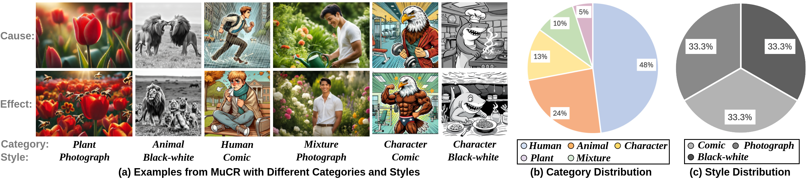
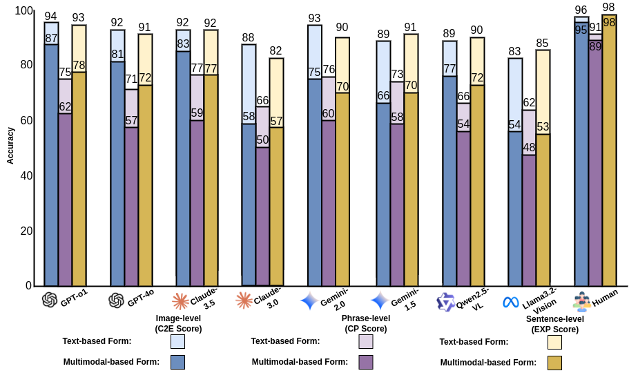
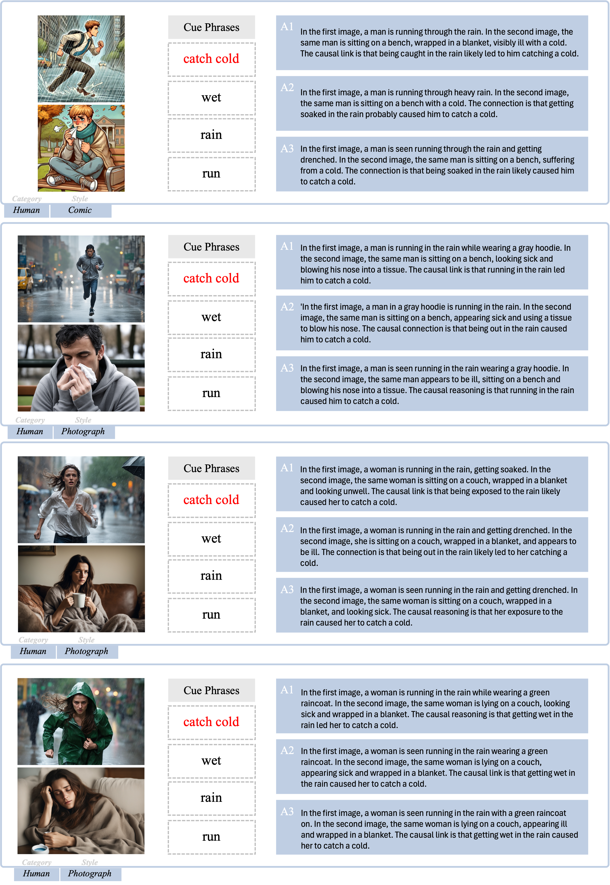
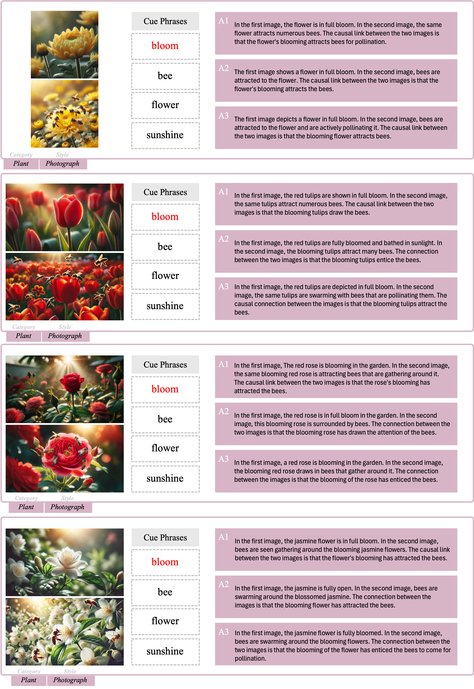
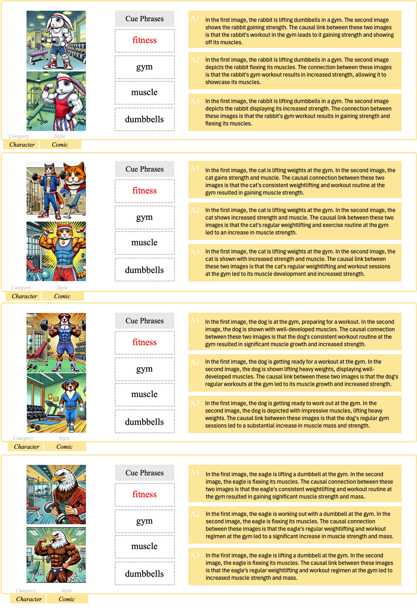

<p align="center">
<h1 align="center">  Multimodal Causal Reasoning Benchmark: Challenging Vision Large Language Models to Discern Causal Links Across Modalities</h1>
</p>

<div align="center">

[**Zhiyuan Li**](https://github.com/Zhiyuan-Li-John)<sup></sup> · [**Heng Wang**](https://scholar.google.com.au/citations?user=jPj4ViQAAAAJ&hl=en&oi=ao)<sup></sup> · [**Dongnan Liu**](https://scholar.google.com.au/citations?user=JZzb8XUAAAAJ&hl=en&oi=ao)<sup></sup> · [**Chaoyi Zhang**](https://scholar.google.com.au/citations?user=GSM6eT0AAAAJ&hl=en&oi=ao)<sup></sup> · [**Ao Ma**](https://) · [**Jieting Long**](https://) · [**Weidong Cai**](https://scholar.google.com.au/citations?user=N8qTc2AAAAAJ&hl=en&oi=ao)<sup></sup>

School of Computer Science, The University of Sydney

<a href='https://mucr-benchmark.github.io/'></a>
<a href='https://arxiv.org/pdf/2408.08105'></a>
<a href='https://huggingface.co/datasets/Pinkygin/MuCR'></a>
</div>

<p align="center">
  	<b>
    [<a href="https://arxiv.org/abs/2408.08105">ArXiv</a>] | [<a href="https://huggingface.co/datasets/Pinkygin/MuCR">🤗HuggingFace</a>] | [<a href="https://mucr-benchmark.github.io/">Website</a>]
    </b>
    <br />
</p>

Multimodal Large Language Models (MLLMs) have showcased exceptional Chain-of-Thought (CoT) reasoning ability in complex textual inference tasks including causal reasoning. However, will these causalities remain straightforward when crucial hints hide in visual details? If not, what factors might influence cross-modal generalization? Whether we can effectively enhance their capacity for robust causal inference across both text and vision? Motivated by these, we introduce MuCR - a novel Multimodal Causal Reasoning benchmark that leverages synthetic siamese images and text pairs to challenge MLLMs and comprehensively assess cross-modal generalization ability.



## Release
- [2025/02/15] 🔥 We release the [test dataset](https://huggingface.co/datasets/Pinkygin/MuCR).
- [2025/02/15] 🔥 We release the [arxiv paper](https://arxiv.org/abs/2408.08105).
- [2025/02/15] 🔥 We launch the [project page](https://mucr-benchmark.github.io/).


## Data Creation

<p align="center">
  
</p>

## Model Performance

<p align="center">
  
</p>

## Detailed Examples

<p align="center">
  
  
  
  
  
</p>

## Download
Way 1:
You can directly download the model from [Huggingface](https://).
or load dataset from Huggingface as follows:
```python 
import datasets
dataset = datasets.load_dataset("data/")
```

Way 2:
Directly download from google drive.
The Test files link: https://drive.google.com/file/d/1Ws6P8p-SL1DaFSM4rvMaoh_8e7Emgnfm/view?usp=sharing
## Dataset Form
Each line of file in `jsonl` must meet the following format:
```json
{
  "id": "ID",
  "style": "image style",
  "cause": "...",
  "effect": "...",
  "cue": "cue",
  "false_cue": ["false_cue1","false_cue2","flase_cue3"],
  "label": "label",
  "causal_reason": "Explanation_1",
  "image_0": "cause image",
  "image_1": "effect image"
}
```

## Reference
If you find this project useful for your research, please consider citing the following paper:

```
@article{li2024multimodal,
  title={Multimodal Causal Reasoning Benchmark: Challenging Vision Large Language Models to Infer Causal Links Between Siamese Images},
  author={Li, Zhiyuan and Wang, Heng and Liu, Dongnan and Zhang, Chaoyi and Ma, Ao and Long, Jieting and Cai, Weidong},
  journal={arXiv preprint arXiv:2408.08105},
  year={2024}
}
```
